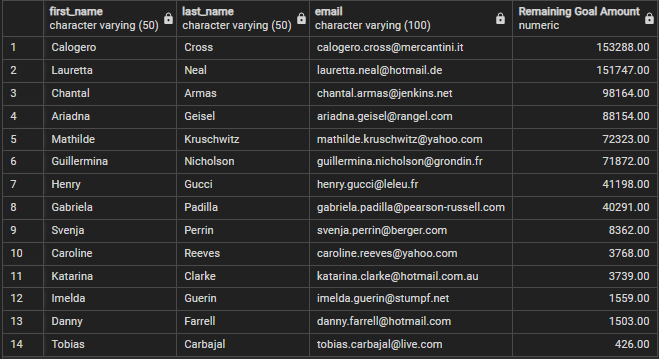

# Crowdfunding ETL
This project focused on the application of Python libraries, like Pandas, and how we leveraged their useful functions for performing efficient Extract, Transform, and Load (ETL) process.

## Table of Contents
- [Overview of Project](#overview-of-project)
  - [Resources](#resources)
  - [Challenge Overview](#challenge-overview)
  - [GitHub Repo Branches](#github-repo-branches)
- [Database Engineering and Analysis Results](#database-engineering-and-analysis-results)
  - [Deliverable 1 and 2](#deliverable-1-and-2)
  - [Deliverable 3](#deliverable-3)
  - [Deliverable 4](#deliverable-4)
- [Summary](#summary)
- [References](#references)

## Overview of Project
This project, including Module 8 assignment, focused on honing our knowledge and skills of data modeling, engineering, and analysis through some rigorous exercises for understanding the concepts of Extract, Transform, and Load ([ETL](https://www.ibm.com/cloud/learn/etl#toc-etl-vs-elt-goFgkQcP)) process, including effective prototyping of data transformation, efficient iterative process, engineering and analysis of relational databases. We leveraged some useful Python libraries and many of its integrated useful modules, functions, and data structures when accomplishing the Extract and Transform phases of the ETL process more efficiently. We then applied some Structured Query Language (SQL) query techniques for analyzing and manipulating crowdfunding databases, and compiling specific list of contacts and backers from the databases.

### Resources
- Input file: Resources.zip
- Source code: Extract_Transform_final_code.ipynb, ETL_Practice.ipynb
- SQL script: crowdfunding_db_schema.sql, crowdfunding_SQL_Analysis.sql
- Output file: category.csv, subcategory.csv, contacts.csv, campaign.csv, backers.csv, email_contacts_remaining_goal_amount.csv, email_backers_remaining_goal_amount.csv
- Image file: png files
- Software: [PostgreSQL](https://www.postgresql.org/docs/), [Quick DBD - free DBD canvas](https://app.quickdatabasediagrams.com/#/), [conda](https://github.com/conda/conda/releases), [Python 3.9](https://docs.python.org/release/3.9.12/), or their newer releases

### Challenge Overview
Our goal is to understand the ETL concepts relevant to relational databases through the use of systematic steps and effective tools that are commonly used when prototyping, modeling, engineering, and exploring databases, which could be applied for delivering in-depth crowdfunding data analysis requirements. Outline of our deliverables and a written report for presenting our results and analysis summary:

- ☑️ Deliverable 1: Extract Data
- ☑️ Deliverable 2: Transform and Clean Data
- ☑️ Deliverable 3: Create an ERD and a Table Schema, and the Load Data
- ☑️ Deliverable 4: SQL Analysis—Bonus and a written report for the Crowdfunding ETL analysis (this ["README.md"](./README.md)).

### GitHub Repo Branches
All deliverables in Module 8 challenge are committed in this GitHub repo as outlined below.  

main branch  
|&rarr; [./README.md](./README.md)  
|&rarr; [./Extract_Transform_final_code.ipynb](./Extract_Transform_final_code.ipynb)  
|&rarr; [./ETL_Practice.ipynb](./ETL_Practice.ipynb)  
|&rarr; [./Resources.zip](./Resources.zip)  
|&rarr; ./Queries/  
  &emsp; |&rarr; [./Queries/crowdfunding_db_schema.sql](./Queries/crowdfunding_db_schema.sql)  
  &emsp; |&rarr; [./Queries/crowdfunding_SQL_Analysis.sql](./Queries/crowdfunding_SQL_Analysis.sql)  
|&rarr; ./Data/  
  &emsp; |&rarr; [./Data/crowdfunding_db_relationships.png](./Data/crowdfunding_db_relationships.png)  
  &emsp; |&rarr; [./Data/category.csv](./Data/category.csv)  
  &emsp; |&rarr; [./Data/subcategory.csv](./Data/subcategory.csv)  
  &emsp; |&rarr; [./Data/contacts.csv](./Data/contacts.csv)  
  &emsp; |&rarr; [./Data/campaign.csv](./Data/campaign.csv)  
  &emsp; |&rarr; [./Data/backers.csv](./Data/backers.csv)  
  &emsp; |&rarr; [./Data/email_contacts_remaining_goal_amount.csv](./Data/email_contacts_remaining_goal_amount.csv)  
  &emsp; |&rarr; [./Data/email_backers_remaining_goal_amount.csv](./Data/email_backers_remaining_goal_amount.csv)  
  &emsp; |&rarr; [./Data/backers.png](./Data/backers.png)  
  &emsp; |&rarr; [./Data/campaign_backers_diff.png](./Data/campaign_backers_diff.png)  
  &emsp; |&rarr; [./Data/email_contacts_remaining_goal_amount.png](./Data/email_contacts_remaining_goal_amount.png)  
  &emsp; |&rarr; [./Data/email_backers_remaining_goal_amount.png](./Data/email_backers_remaining_goal_amount.png)  

## Database Engineering and Analysis Results
The Entity Relationship Diagrams (ERDs) that mimicked relationships in our crowdfunding databases can be reviewed in Fig. 1, which I created by using a free Quick DBD canvas after completing the Extract and Transform phases. During the process, we mainly used Pandas, Numpy, json (JavaScript Object Notation), and re (regular expression or regex) modules to extract, clean, and transform our initial databases. And afterward, we loaded and explored the cleaned databases by using an open source DBMS, PostgreSQL and pgAdmin, created SQL schema, tables, and attributes based on our ERD, and wrote some SQL queries for further exploring the database.

\
**Fig. 1 Entity Relationship Diagrams of Crowdfunding ETL databases**

### Deliverable 1 and 2
The corresponding Jupyter Notebook source codes can be referred in [ETL_Practice.ipynb](./ETL_Practice.ipynb) and [Extract_Transform_final_code.ipynb](./Extract_Transform_final_code.ipynb). I used a few code refactoring approaches that might be unique when completing the Extract and Transform steps, for example:

- `list()`, `insert()`, and `df.reindex()` for manipulating the position of columns and reordering the columns in some of our cleaned dataframes.
- `df.equals()` and `df.compare()` for comparing dataframes created by regex vs dictionary methods. I also applied simplified regex capturing groups when transforming and cleaning the *backers* dataframe.
- `try` and `except` for bypassing errors and allowing multiple executions after dropping certain columns.

The cleaned crowdfunding databases after the transformation step were saved into csv formatted files at the end of the Transform step as follows.

- [category.csv](./Data/category.csv)  
- [subcategory.csv](./Data/subcategory.csv)  
- [contacts.csv](./Data/contacts.csv)  
- [campaign.csv](./Data/campaign.csv)  
- [backers.csv](./Data/backers.csv)  

### Deliverable 3
The ERDs of our crowdfunding databases are shown in Fig. 1. To accomplish the Load phase of the ETL process, I applied either the standard query technique such as `FOREIGN KEY .. REFERENCES ..` or the tedious query technique by using the combination of `ALTER TABLE .. ADD CONSTRAINT .. FOREIGN KEY ..` and `REFERENCES ..` clauses when assigning foreign keys and referencing other tables to replicate our ERDs. The code snippets are outlined below, the first 10 rows of *backers* table (**Table 1**), and the complete SQL scripts can be referred in [crowdfunding_db_schema.sql](./Queries/crowdfunding_db_schema.sql).

```
-- Creating tables for crowdfunding_db named campaign
CREATE TABLE campaign (
	cf_id int NOT NULL,
	contact_id int NOT NULL,
	company_name varchar(100) NOT NULL,
	description text NOT NULL,
	goal numeric(10,2) NOT NULL,
	pledged numeric(10,2) NOT NULL,
	outcome varchar(50) NOT NULL,
	backers_count int NOT NULL,
	country varchar(10) NOT NULL,
	currency varchar(10) NOT NULL,
	launched_date date NOT NULL,
	end_date date NOT NULL,
	category_id varchar(10) NOT NULL,
	subcategory_id varchar(10) NOT NULL,
	PRIMARY KEY (cf_id),
	FOREIGN KEY (contact_id) REFERENCES contacts (contact_id),
	FOREIGN KEY (category_id) REFERENCES category (category_id),
	FOREIGN KEY (subcategory_id) REFERENCES subcategory (subcategory_id)
);
-- Creating tables for crowdfunding_db named backers
CREATE TABLE backers (
	backer_id varchar(10) NOT NULL,
	cf_id int NOT NULL,
	first_name varchar(50) NOT NULL,
	last_name varchar(50) NOT NULL,
	email varchar(100) NOT NULL,
	PRIMARY KEY (backer_id)
);
ALTER TABLE backers ADD CONSTRAINT fk_backers_cf_id FOREIGN KEY (cf_id)
REFERENCES campaign (cf_id);
```

**Table 1. First 10 rows of backers database**\


### Deliverable 4
I introduced some additional SQL queries for exploring our cleaned databases further and reproducing the requirements in Deliverable 4. During the process of generating specific list of contacts and backers from the databases, I renamed the required column headers that contained spaces to perfectly replicate Deliverable 4-3 and 4-4 requirements, i.e. "Remaining Goal Amount" and "Left of Goal." Some best practices, however, suggested the use of lowercase letters, numbers, and underscores whenever feasible.

- Deliverable 4-1 was accomplished by using the following simplified query.

```
SELECT cf_id, backers_count
INTO backers_by_cf_id
FROM campaign
WHERE (outcome = 'live')
GROUP BY cf_id
ORDER BY backers_count DESC;
-- Check the table
SELECT * FROM backers_by_cf_id;
```

- Deliverable 4-2 was similarly accomplished by using the following simplified query, which included `COUNT(backer_id)` clause. And for confirming the accuracy of the outcomes, I created a comparison table (**Table 2**) by executing a separate SQL query to make sure if both methods matched. **Table 2** reconfirmed that our results generated by two different queries matched completely.

```
SELECT cf_id, COUNT(backer_id) AS count_fr_backers
INTO backers_by_cf_id_fr_backers
FROM backers
GROUP BY cf_id
ORDER BY count_fr_backers DESC;
-- Check the table
SELECT * FROM backers_by_cf_id_fr_backers;
```

```
-- Create comparison table of backer_counts by cf_id
SELECT ca.cf_id,
	ca.backers_count,
	ba.count_fr_backers
INTO campaign_backers_diff
FROM backers_by_cf_id AS ca
	LEFT JOIN backers_by_cf_id_fr_backers AS ba
	ON ca.cf_id=ba.cf_id
ORDER BY count_fr_backers DESC;
-- Check the table
SELECT * FROM campaign_backers_diff;
```

**Table 2. Comparison of backer_counts per cf_id tables generated by using two different queries**\


- Deliverable 4-3 was completed by using the following query. The resulting database was saved as [email_contacts_remaining_goal_amount.csv](./Data/email_contacts_remaining_goal_amount.csv) and summarized in **Table 3**.

```
SELECT co.first_name,
	co.last_name,
	co.email,
	(ca.goal - ca.pledged) AS "Remaining Goal Amount"
INTO email_contacts_remaining_goal_amount
FROM campaign AS ca
	LEFT JOIN contacts AS co
	ON co.contact_id = ca.contact_id
WHERE (ca.outcome = 'live')
ORDER BY "Remaining Goal Amount" DESC;
-- Check the table
SELECT * FROM email_contacts_remaining_goal_amount;
```

**Table 3. email_contacts_remaining_goal_amount table sorted by "Remaining Goal Amount"**\


- Deliverable 4-4 was achieved by using the following query. The resulting database was saved as [email_backers_remaining_goal_amount.csv](./Data/email_backers_remaining_goal_amount.csv) and summarized in **Table 4**.

```
SELECT ba.email,
	ba.first_name,
	ba.last_name,
	ca.cf_id,
	ca.company_name,
	ca.description,
	ca.end_date,
	(ca.goal - ca.pledged) AS "Left of Goal"
INTO email_backers_remaining_goal_amount
FROM backers AS ba
	LEFT JOIN campaign AS ca
	ON ca.cf_id = ba.cf_id
WHERE (ca.outcome = 'live')
ORDER BY ba.last_name, ba.email ASC;
-- Check the table
SELECT * FROM email_backers_remaining_goal_amount;
```

**Table 4. email_backers_remaining_goal_amount table sorted by last_name and email**\


## Summary
All deliverables have been completed and summarized according to Module 8 assignment requirements, including the analysis bonus challenges by using SQL queries. I tried my best to avoid ambiguous referencing when writing the SQL queries. The refactored SQL scripts for accomplishing the bonus challenges can be referred in [crowdfunding_SQL_Analysis.sql](./Queries/crowdfunding_SQL_Analysis.sql).

## References
[Database model](https://en.wikipedia.org/wiki/Database_model)\
[ETL (Extract, Transform, Load)](https://www.ibm.com/cloud/learn/etl)\
[Pandas User Guide](https://pandas.pydata.org/pandas-docs/stable/user_guide/index.html#user-guide)\
[re - Regular expression operations](https://docs.python.org/3/library/re.html)\
[json - JSON encoder and decoder](https://docs.python.org/3/library/json.html)\
[PostgreSQL documentation](https://www.postgresql.org/docs/)\
[pandas.Series.str.split](https://pandas.pydata.org/docs/reference/api/pandas.Series.str.split.html)\
[pandas.DataFrame.equals](https://pandas.pydata.org/docs/reference/api/pandas.DataFrame.equals.html#pandas.DataFrame.equals)\
[Using OR in SQLAlchemy](https://stackoverflow.com/questions/7942547/using-or-in-sqlalchemy)\
[How to change Order of Columns in Pandas DataFrame?](https://pythonexamples.org/how-to-change-order-of-columns-in-pandas-dataframe/#:~:text=Change%20Order%20of%20DataFrame%20Columns%20in%20Pandas&text=You%20can%20change%20the%20order,rearranged%20column%20list%20as%20argument.&text=The%20reindex()%20function%20returns,the%20given%20order%20of%20columns.)
